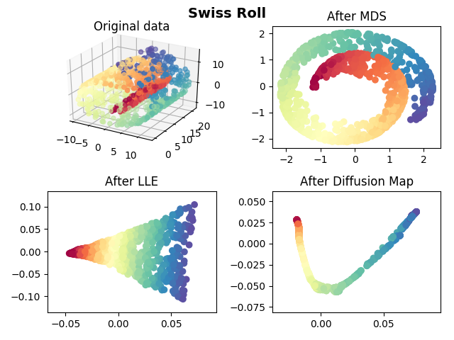
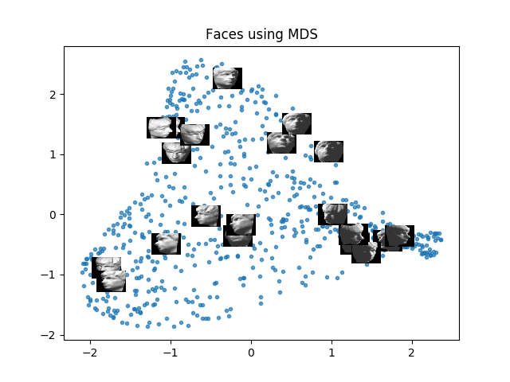
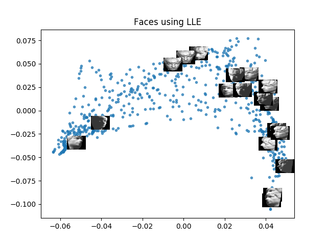
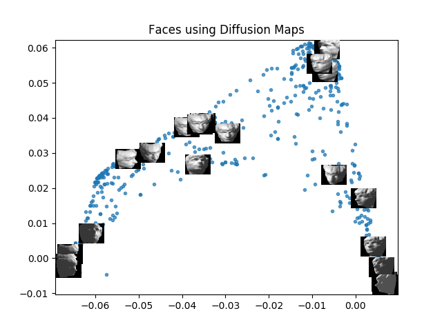
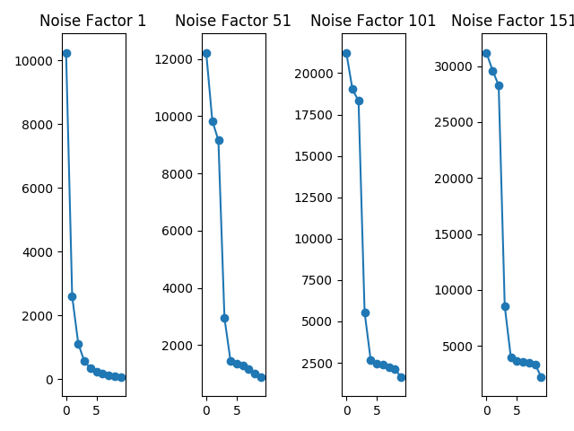

# Manifold Dimensionality Reduction

MDS LLE and Diffusion map dimensionality reduction methods
for MNIST, Swiss roll and faces data sets

## MNIST Digits

Figure 1:
 Here we are trying to take images of digits (64*64) reduce their dimension
to 2d and display the points over a scatter plot,
we expect points with the same color(meaning they came from the same
label - digit) to appear close in the plot.
 We can see that MDS compared to LLE and Diffusion map takes most of
the points and put them close together with less overlap between digits
but in a relatively big cloud.

## Swiss Roll

Figure 2:
 In manifold learning we are recovering a global shape from local diffrence
anity while using local differences.
In the case of the swiss roll Euclidean distance is not the best therefor a
PCA won't do the job.
 LLE works good in this case since it actually expresses each point in
a linear sub-space created by it's nearest neighbors
 Diffusion Map takes into account all the relation between points x
and y while calculating the distance and serves as a better notion of
proximity than just Euclidean distance(in LLE we lose that notion)
 MDS works best when the data is approximately on a subspace, but
in our case we have many sub spaces therefore MDS result is not
satisfying

## Faces

Figure 3

Figure 4

Figure 5

Using dimension reduction on this faces set is suppose to visualize in 2D
the biggest motifs in those pictures, we can actually see that the axis
express the faces rotation

## Scree Plot

We can see the knee we are getting, rst when we have less noise at the
2D and as the noise grows it gets much more tough to
MDS algorithm to get the actual dimension of the embedded data.

